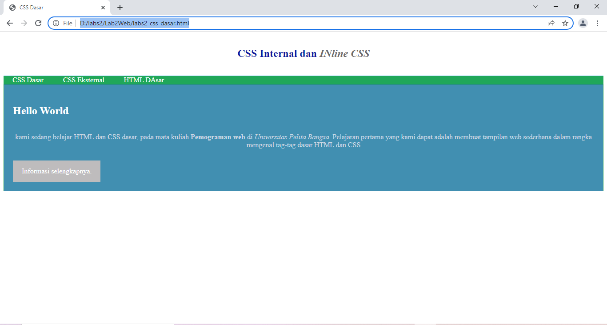
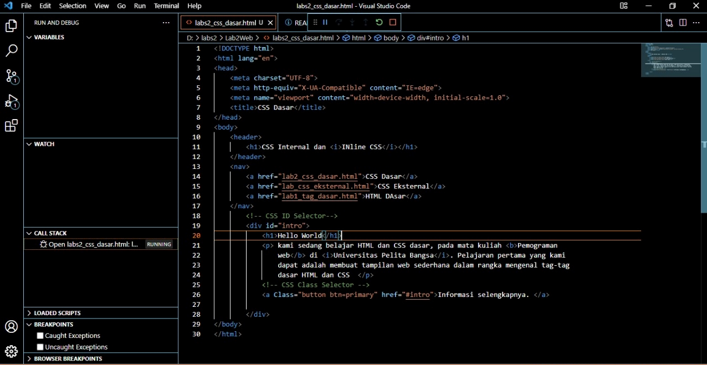

# Lab2Web
## Belajar CSS dasar

### membuat CSS dasar
HAsil pembelajaran CSS dasar praktikum 2
ini adalah tampilannya

hasil pengabilan gambar

selanjutnya buka pada web browser melihat hasilnnya

<b>2. Mendekklarasi CSS Internal</b>
