# Lab2Web
### RONY ELTOM ATIBMAN
### TI.20.D.1

## 1. Buatlah dokumen HTML seperti berikut

selanjutnya buka pada web browser melihat hasilnnya

## 2. Mendekklarasi CSS Internal
kemudian tambahkan deklarasi CSS INternal seperti berikut pada bagian head dokumen
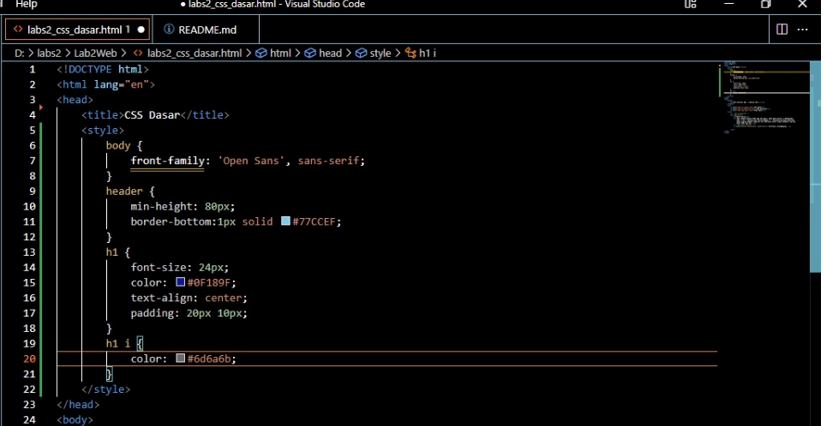
Selanjutnya simpan perubahan yang ada, dan lakukan refresh pada browser untuk melihat hasilnya
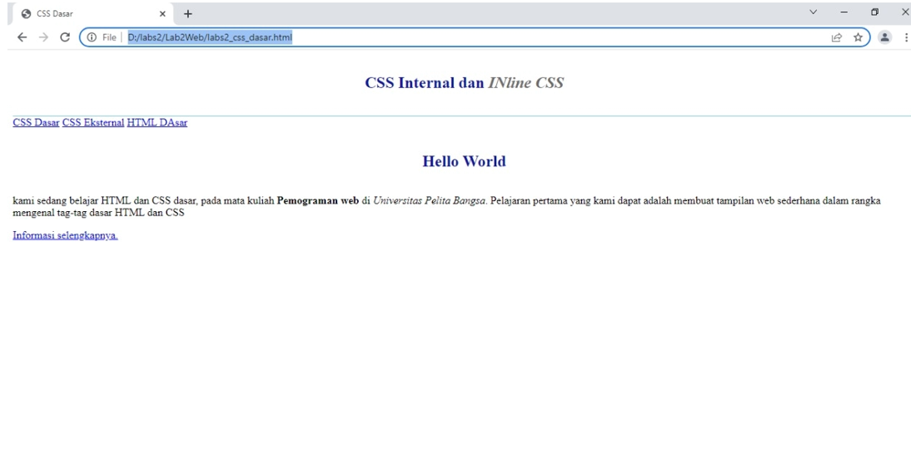

## 3. Menambahkan Inline CSS
Kemudian tambahan deklarasi Inline CSS pada tag `
` seperti berikut.
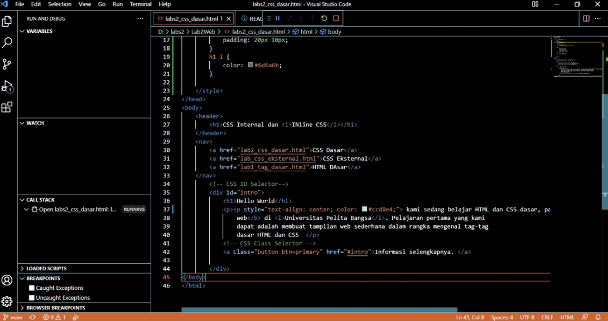
simpan kembali dan refresh kembali browser untuk melihat perubahannya.
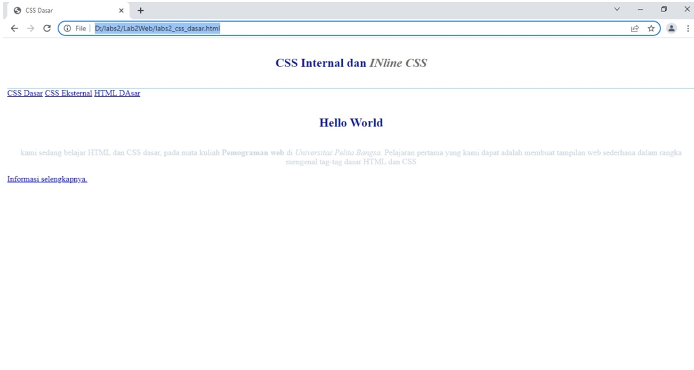

## 4. Membuat CSS Ekternal
Buatlah File dengan nama <b>style_eksternal.css</b> kemudian buatlah deklarasi CSS seperti berikut
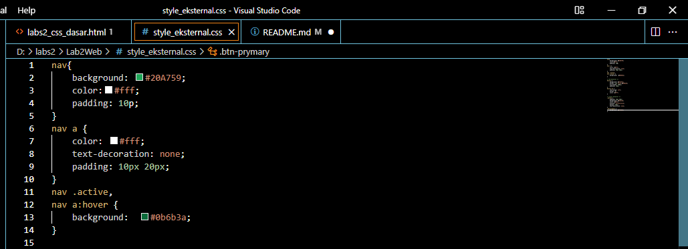
Kemudian tambahkan tag `<link>` untuk merujuk file css yang dibuat pada bagian `<head>`
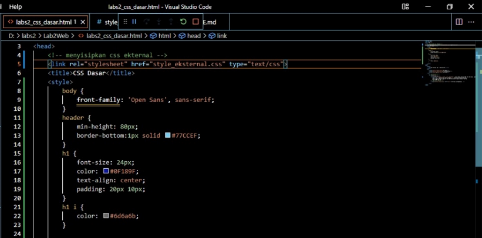
Selanjutnya refresh kembali browser untuk melihat perubahannya.
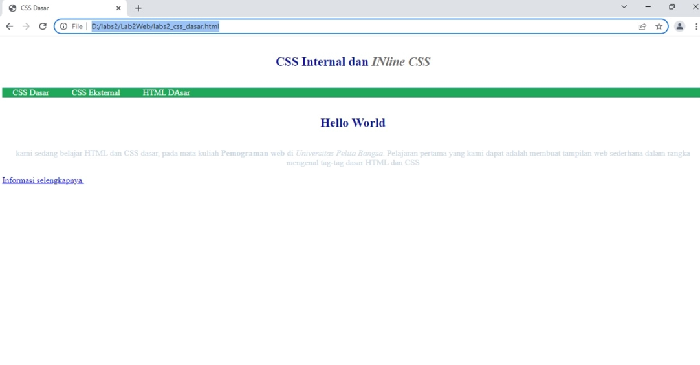

## 5. Menambahkan CSS Selector
Selanjutnya menambahkan CSS selector menggunakan ID dan Class Selector. pada file <b>STyle_eksternal.css</b> tambahkan kode berikut.
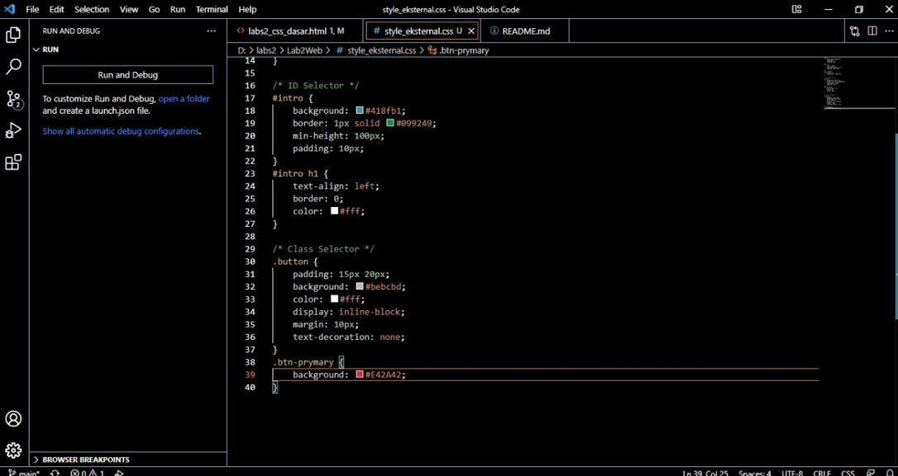
kemudian  simpan kembali dan refresh browser untuk melihat perubahannya.

# pertanyaan dan tugas
### 1. lakukan EKsperimen dengan mengubah dengan nilai dan menambah properti dan nilai pada kode CSS dnegan mengacu pada CSS Cheat sheet yang di berikan pada file terpisah yang diberikan pada file terpisah dari modul ini 
* saya melakukan beberapa experimen seperti mengubah nilai yang hasilnya mengubah ukuran ataupun warna dan mengganti bacground
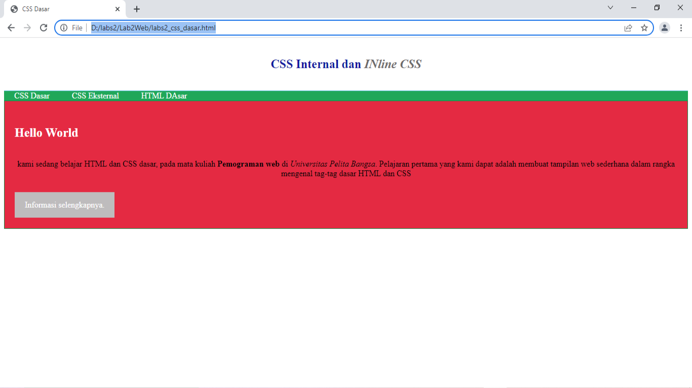

### 2. apa perbedaan pendeklarasian CSS elemen h1{...} dengan #intro h1{...}? berikan penjelasan
* Pendeklarasian CSS elemen h1 mengubah tampilan seleuruh elemen yang memiliki tag h1, sedangkan #intro h1 hanya mengubah tampilan elemen h1 yang memiliki #intro h1.

### 3. apabila ada deklarasi CSS secara INternal, lalu ditmabahkan CSS eksternal dan inline CSS pada elemen sama. deklarasi manakah yang akan di tampilkan pada browser? berikan penjelasan dan contohnya!
* setelah saya mencoba, jika mendeklarasi CSS pada elemen yang sama namun dengan isi deklarasi berbeda, maka semua dekalarasi CSS tersebut akan ditampilkan. contohnya :
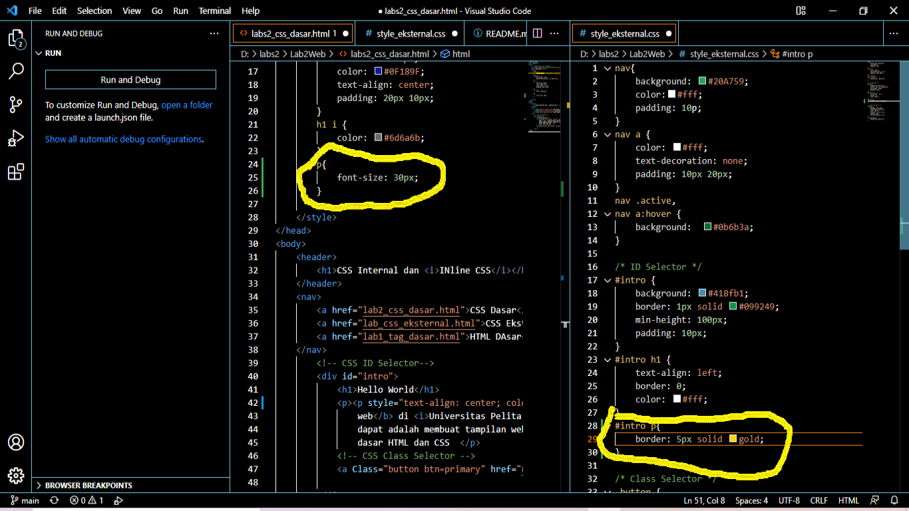
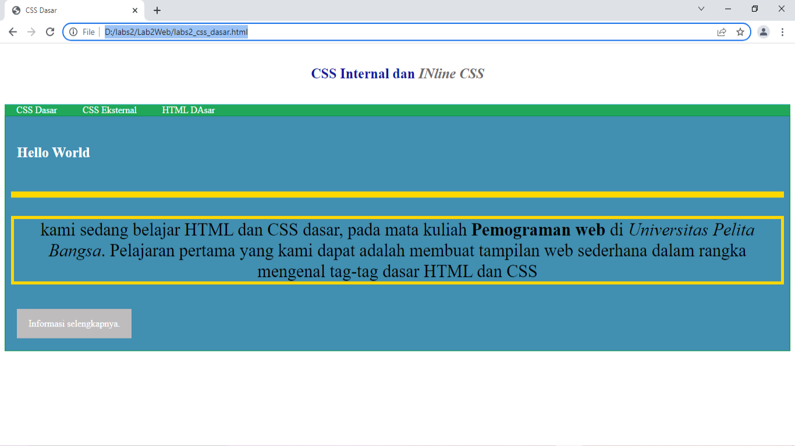

* Namun jika isi dari ketiga deklarasi CSSnya sama semua, maka browser hanya menampilkan salah satunnya, dengan urutan inline CSS, Eksternal CSS, dan yang terakhir Internal CSS.
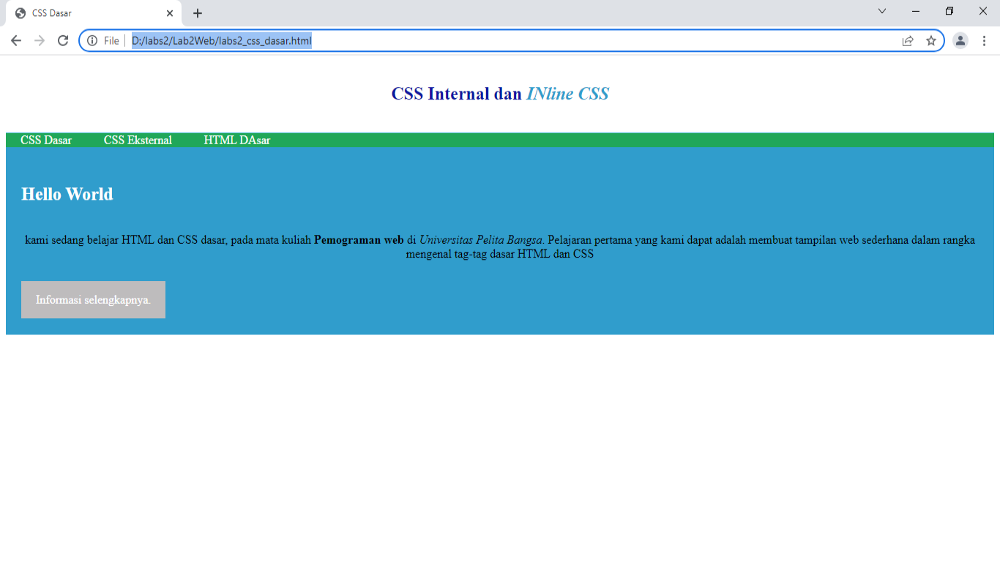

### 4. pada sebuah elemen HTML terdapat ID dan Class, apabila masing-masing selector tersebut terdapat deklarasi CSS, maka deklarasi manakah yang akan di tampilkan pada browser? berikan penjelasan dan contohnya!
* kedua deklarasi tersebut akan tampil, namun selector ID yang akan tammpiljika deklarasinya ada yang sama antara ID dan Class.
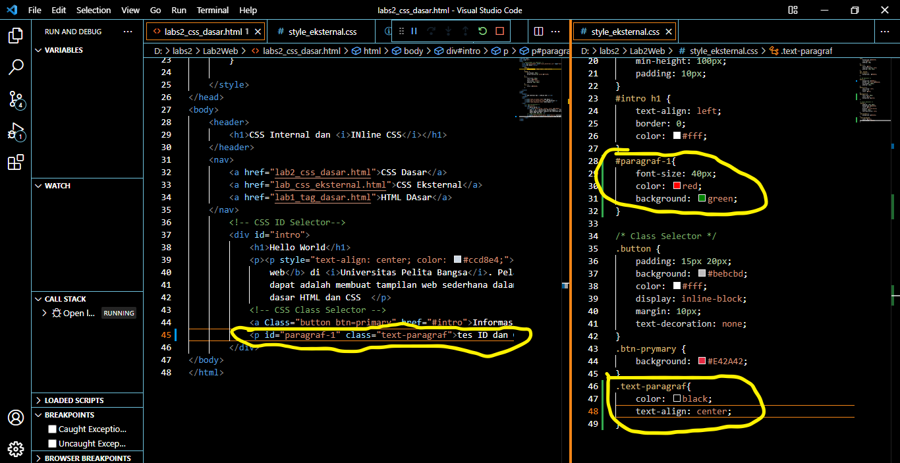
